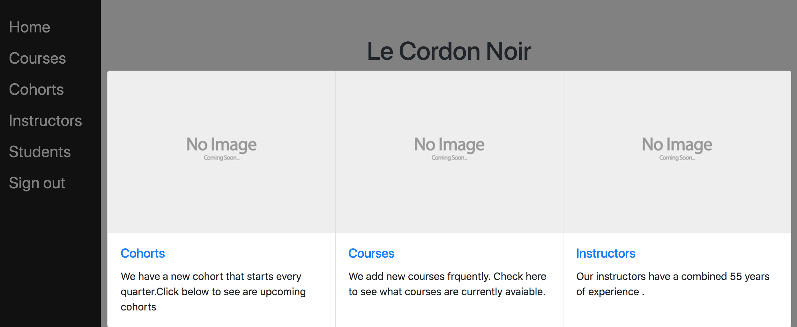

## Description

### Admin panel for a fictitious school whereby the administrator can create users and complete common administrative tasks.

### Ruby version -  5.2.1

### Built with
  * Ruby on Rails
  * Devise for user authentication
    * AJAX in Rails
  * jQuery 
  * HTML
  * CSS/ SCSS
  * Bootstrap
  * Postgres

### Functionality :
 **Students** : CRUD functionlity.First and last name required, age limit of 150, and deletion enabled via an ajax call.
 **Instructors** : CRUD functionlity.First and last name required, age limit of 150, salary can't be less then 0, highest completed education limited to HS, College, Masters, PHD and deletion enabled via an ajax call
**Cohorts** : CRUD functionlity.Instructors can be added to cohorts, cohorts can be added to Courses and students can be added to cohorts. Deletion enabled via ajax call. User can view start and end date, instructor teaching the cohort and students in the cohort
**Courses** : CRUD functionlity. name requiremnt,total in calss hours must be greater than, and deletion eneabled via ajax call
 * **CRUD : Create,Read,Update,Delete**

### Demo 
 **username** : test@example.com
 **password** : password

